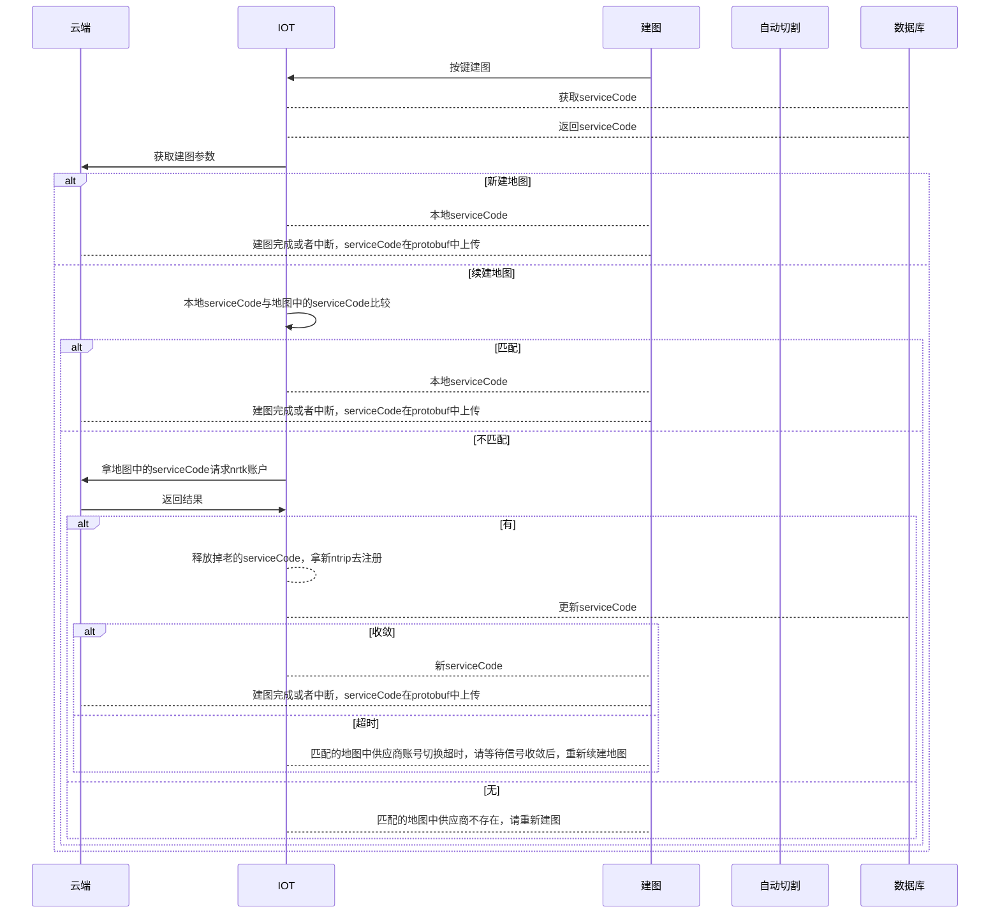

```mermaid
sequenceDiagram
    participant C as 云端
    participant I as IOT
    participant M as 建图
    participant A as 自动切割
    participant D as 数据库

    M ->> I : 按键建图
    I --> D : 获取serviceCode
    D --> I : 返回serviceCode
    I ->> C: 获取建图参数

    alt 新建地图 
        I --> M : 本地serviceCode
        M --> C : 建图完成或者中断，serviceCode在protobuf中上传
    else 续建地图
        I ->> I: 本地serviceCode与地图中的serviceCode比较
        alt 匹配
            I --> M : 本地serviceCode
            M --> C : 建图完成或者中断，serviceCode在protobuf中上传
        else 不匹配
            I ->> C: 拿地图中的serviceCode请求nrtk账户
            C ->> I: 返回结果
            alt 有
              I --> I : 释放掉老的serviceCode，拿新ntrip去注册
              I --> D : 更新serviceCode
            alt 收敛
              I --> M : 新serviceCode
              M --> C : 建图完成或者中断，serviceCode在protobuf中上传 
            else 超时
               I --> M : 匹配的地图中供应商账号切换超时，请等待信号收敛后，重新续建地图
            end
            else 无
              I --> M : 匹配的地图中供应商不存在，请重新建图
            end

        end
    end
```